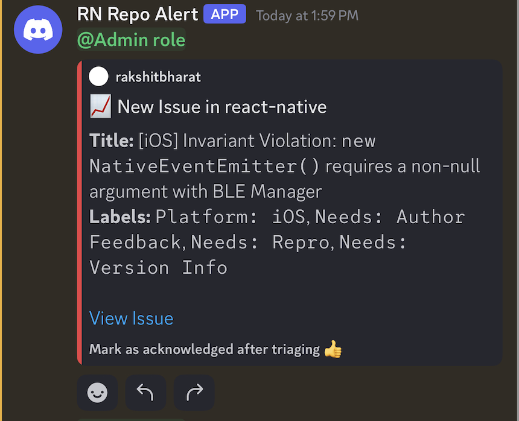

# Issue Triaging with Discord Notifications

*Forked from [shubhaamgupta11/repo-monitor](https://github.com/shubhaamgupta11/repo-monitor).*

It is designed to monitor new issues in the React Native repository and send notifications to Discord for better issue triaging.

## Features

- Tracks new **issues** in the React Native repository.
- Sends notifications to **Discord**.
- Allows configuring **Discord** notifications to mention users or roles.

## Usage

### Monitor Issues with Discord

Create a GitHub Actions workflow file (e.g., .github/workflows/monitor.yml) with the following:

```yml
name: Monitor React Native Issues

on:
  schedule:
    - cron: "0 * * * *" # Runs every hour
  workflow_dispatch: # Optional to trigger manually

jobs:
  run-notifier:
    runs-on: ubuntu-latest
    steps:
      - name: Set up Node.js
        uses: actions/setup-node@v4
        with:
          node-version: '20'
      - name: Monitor New Issues
        uses: react-native-community/repo-monitor@v1.0.0
        with:
          # required inputs
          task: "monitor-issues"
          git_secret: "${{ secrets.GIT_SECRET }}"
          notifier: "discord"
          fetch_data_interval: 1  # Hours (must align with your cron schedule)
          # repo inputs
          repo_owner: "facebook"
          repo_name: "react-native"
          # Discord-specific inputs
          discord_webhook_url: "${{ secrets.DISCORD_WEBHOOK_URL }}"
          discord_id_type: "<user/role>" # Optional: Only needed to ping someone directly.
          discord_ids: "<user-id/role-id>" # Optional: Only needed if discord_id_type is provided. Can pass multiple similar type ids separated by commas. e.g. "Uyyyxxxx,Uzzzxxxx"
```

### Discord Notification Preview

New issue notifications will be sent to Discord, mentioning the configured user or role.



## 🔧 Inputs

| Input | Description | Required | Default |
| ----- | ----------- | -------- | ------- |
| task | The task to run (monitor-issues or monitor-prs). | Yes | None |
| git_secret | GitHub token for authentication. | Yes | None |
| repo_owner | The owner of the GitHub repository (`user-name`). | Yes | None |
| repo_name | The name of the GitHub repository (`repo-name`). | Yes | None |
| fetch_data_interval | The time interval to fetch data for (e.g., 1 hour, 24 hours). This should align with the cron schedule. | Yes | None |
| notifier | Notification method (**slack** or **discord**). | Yes | None |
| discord_webhook_url | Discord webhook URL to send notifications (required if notifier=`discord`). | No | None |
| discord_id_type | Type of Discord ID (user or role, required if notifier=`discord`). This is needed to ping someone directly. | No | None |
| discord_ids | user id or role id as per `discord_id_type` (required if notifier=`discord`). Can pass multiple similar type ids separated by commas. e.g. "Uyyyxxxx,Uzzzxxxx" | No | None |

## 🔧 Setting Up

### Discord

- Create a [Discord Webhook](https://support.discord.com/hc/en-us/articles/228383668-Intro-to-Webhooks).
- Copy the Webhook URL.
- Add the Webhook URL to your GitHub repository secrets as `DISCORD_WEBHOOK_URL`.
- Retrieve the User/Role IDs.
- Add these secrets to your GitHub repository:
  - `DISCORD_WEBHOOK_URL`
- Provide the Discord Webhook URL, Discord ID Type and Discord ID in the workflow.

## 🔮 Roadmap

Full roadmap can be found [here](https://github.com/shubhaamgupta11/repo-monitor?tab=readme-ov-file#-roadmap).

## 📜 License

This project is licensed under the [MIT License](https://github.com/react-native-community/repo-monitor/blob/main/LICENSE).

## Support & Feedback
If you find this action helpful, please give the repository a ⭐️ on GitHub! Your support helps us grow and continue improving. Feel free to raise issues or suggest enhancements to make this even better.
